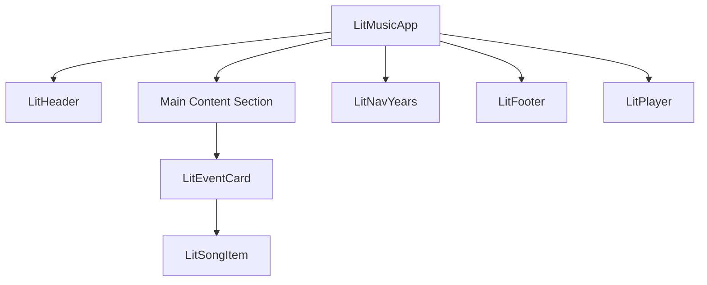

# LiT! Music 開発ドキュメント (README_DEV.md)

このドキュメントは、LiT! Music (v2) の技術仕様、設計思想、および開発ガイドラインをまとめたものです。OSSとしてのメンテナンス性向上を目的としています。

---

## 1. 技術スタック

- コアライブラリ: [Lit](https://lit.dev/)
- ビルドツール: [Vite](https://vitejs.dev/)
- 言語: TypeScript
- スタイリング最適化: PostCSS
- マークダウン解析: [marked](https://marked.js.org/)
- 外部API: YouTube IFrame Player API
- デプロイ: GitHub Pages (gh-pagesブランチ)
- パッケージ管理: yarn

---

## 2. ディレクトリ構造

```text
src/
├── components/           # Litコンポーネント
│   ├── lit-app.ts        # ルート
│   ├── lit-header.ts     # ヘッダー
│   ├── lit-footer.ts     # フッター
│   ├── lit-nav-years.ts  # 右側ナビゲーション
│   ├── lit-player.ts     # 音楽プレイヤー
│   ├── lit-event-card.ts # 各イベントのカード
│   └── lit-song-item.ts  # 各楽曲の行
├── data/                 # データファイル
│   ├── index.json        # 楽曲・イベントのマスターデータ
│   └── loading.json      # ロード画面のメッセージ
├── post/                 # 楽曲リクエストフォーム
│   ├── index.html        # フォーム画面
│   └── main.ts           # Issue作成用ロジック
├── styles/               # スタイル関連
│   ├── index.css         # グローバルCSS
│   ├── icons.ts          # インラインSVGアイコン
│   └── shared-styles.ts  # コンポーネント間で共有するスタイル
├── types.ts              # TypeScript型定義
└── main.ts               # エントリーポイント
```

---

## 3. アーキテクチャ設計

### 3.1 コンポーネント構成

本アプリは単一のルートコンポーネント `LitMusicApp` を中心としたツリー構造になっています。



### 3.2 状態管理

- Global State: `LitMusicApp` が再生中の曲、キュー、アクティブなタブ、スクロール位置などの主要な状態を一括管理しています。
- Communication:
  - Props: 親から子へデータを渡します（例: `isMVMode`, `activeTab`）。
  - Events: 子から親へアクションを通知します（例: `play-song-queue`, `tab-changed`）。

---

## 4. 主要コンポーネント仕様

### `LitMusicApp` (src/components/lit-app.ts)

- アプリのルート。データのフェッチ（import）、スクロールイベントの監視、YouTubeプレイヤーの制御（キュー管理）を行います。
- `isMVMode`: Music Videoモードが有効な場合、全体のレイアウトを「左: コンテンツ, 右: 動画」の50%/50%分割に切り替えます。

### `LitPlayer` (src/components/lit-player.ts)

- YouTube IFrame Player APIをラップしたコンポーネント。
- MVモード時には右側に固定表示され、通常時は下部にプログレスバーとして表示されます。

### `LitHeader` (src/components/lit-header.ts)

- スプラッシュ画面から通常ヘッダーへの遷移アニメーションを管理します。
- `introProgress` 変数（0.0〜1.0）に基づき、ロゴのスケールやヘッダーの高さを動的に計算します。

---

## 5. データ構造 (`src/data/index.json`)

- 楽曲データは`src/data/index.json` で管理されています。
- JSONでは、該当する内容がない場合(カラオケにない曲など)であっても、空のvalueでkeyを定義する必要があります。
- 詳しい制約については`src/data/schema.json` を参照してください。
- VSCodeでは`schema.json`に違反している場合、自動的に警告が表示されます。

---

## 6. 開発ガイドライン

### 命名規則

- コンポーネント名: lit- (例: lit-header)。Custom Elementsの仕様に基づき、必ずハイフンを含めます。
- CSS変数: `index.css` で定義された `--color-*` 形式の変数を使用し、直接的な色指定は避けてください。
- red,yellow,green,blueは Life is Tech ! のロゴに準じた配色とします。

### レスポンシブ対応

- 基本的なブレイクポイントは768pxです。必要に応じてメディアクエリを追加してください。
- MVモードと右側ナビゲーション、プログレスバーはデスクトップでのみ使用可能です。

---

## 7. 補助ツール・自動化

### 7.1 YouTube再生確認ツール (`play-status-checker.gs`)

- Google Apps Script (GAS) を用いたツール。毎時16分30秒にスクリプトが実行されます。
- `src/data/index.json` を定期的にスキャンし、YouTube Data API を使用して動画が削除・非公開になっていないか自動チェックします。
- `README.md`のデプロイバッジにレスポンスする処理もここに記述されています。
- 現状、スプレッドシートの運用アカウントは かなやん(@kanayankee) が管理しています。
- スプレッドシート: https://docs.google.com/spreadsheets/d/1HW8CRwjpsmoDviLKqOfo1WbGwAMKDi9JZfW8oue1Bgk/view
- 編集権限が必要な場合は、スプレッドシートの標準機能を使ってリクエストを送ってください。リクエストの際はコメント欄にGitHubのIDを記載していただけると助かります。

### 7.2 GitHub Actions

- `code-check.yml`: プルリクエスト時に TypeScript の型チェック (`tsc`) を自動実行します。
- `deploy.yml`: `main` ブランチへのプッシュ時、Vite でビルドを行い GitHub Pages へ自動デプロイします。

---

## 8. 楽曲リクエストフォーム (`/post/`)

- ユーザーが新しい楽曲を簡単に追加リクエストできるようにするための補助ツールです。
- フォームに入力された内容を JSON 形式に変換し、GitHub の「New Issue」作成画面を事前入力済みの状態で開きます。
- `post/index.html` としてビルドされます。

---

## 9. セットアップ

```bash
# 依存関係のインストール
yarn install

# 開発サーバー起動
yarn dev

# ビルド (dist/ に出力)
yarn build
```
